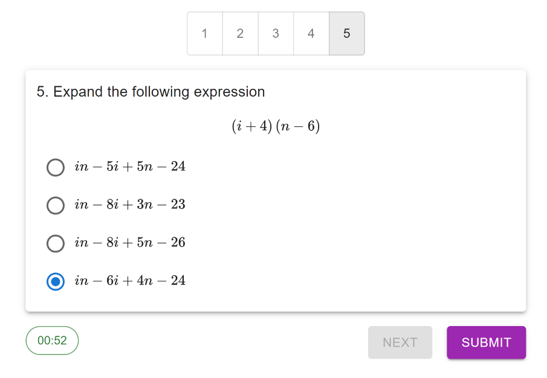

# Quizzicalc

Quizzicalc aims to be a convenient platform for students and tutors to make quizzes for simple algebraic problems, while keeping them engaging. Users can generate quizzes of 2 different topics and variable difficulty, and with the help of the symbolic computation library SymPy, the quizzes generated are truly random. Every quiz is reproducible, so users are able to share quizzes to compete with their friends!

Built using React and Django.



<br/>

## Running the project

Clone this repository onto your computer.

To install the Python dependencies (including Django), in the root folder:
```
pip install requirements.txt
```

Ensure that you have [Node.js](https://nodejs.org/en) (v18.16.0 was used as of development) installed. To download the relevant dependencies to build the React project, in ```/frontend```:

```
npm install
npm run build
```

Once the build directory has been created, we may run the Django project within the root folder:

```
python manage.py runserver
```

After which Quizzicalc should be running locally.

---

## A brief explanation of quiz generation & serialization

In the quiz generator, each question (either "Expand" or "Factorise"-type questions), their answers, along with 3 other sufficiently convincing options, are generated randomly and on-the-fly with the help of SymPy.

An simple expression like $(a+1)(b+2)$ can be written as an expression tree, like so:
```
       x
     /   \
    +     +
   / \   / \
  a   1 b   2
```
where the internal nodes can be any binary operator (e.g. $+,\times$), and the leaves are the variables/constants. Thus in our quiz generator we randomly generate such complete expression trees. The benefits of using complete expression trees were that

* More interesting expressions involving order of parentheses are generated (by nature of the tree structure)
* With each tree being complete, the height of each tree corresponds naturally to the complexity of each question, providing a method to customise difficulty

[SymPy](https://www.sympy.org/en/index.html) (symbolic computation library) was then used to expand/factorise each expression to obtain the correct answers. In order to generate 3 other convincing options, each constant in the expression tree would be randomly changed by some $\pm r$ before being simplified by SymPy. 

In order to make the quizzes reproducible, while storing them in the database would be perfectly viable, we wanted to try serializing each quiz into a unique "seed" for others to use. 

For every expression tree, given its preorder traversal (like $[x,+,a,1,+,b,2]$ for the tree above), we can reconstruct the unique tree since we know exactly where the internal nodes and leaves must be (since they are complete). Thus we need only serialize the preorder traversal arrays.

Each internal node can only either be $\{+,\times\}$ so they require 1 bit. For a 2-variable expression, the leaves can take any value from $[-9,9]$ or $\{a,b\}$ (arbitrary variables), so they require 5 bits.

For example, suppose the question has a preorder traversal

$$[\times,+,a,5,\times,6,b]$$

All internal nodes are encoded into a 1-bit equivalent, and all leaves are encoded into a 5-bit equivalent, then we concatenate the array into a base64 string:

$$ 
[1,0,10011,01110,1,01111,10100]\rightarrow 10100110111010111110100\rightarrow \textrm{``U3X0"}
$$

Since topic is Expand ("e"), number of qns is 1 (0-indexed so we represent it with a 0), and difficulty level is 1, these 3 characters are appended, resulting in the final seed "U3X0e01".

In general, a quiz with $Q$ questions, with difficulty level $D$, the seed generated will have about $Q*(2^{D+1} -1/6) + 3$ characters, which saves about 50% characters as opposed to if we were to directly concatenate every expression tree.


